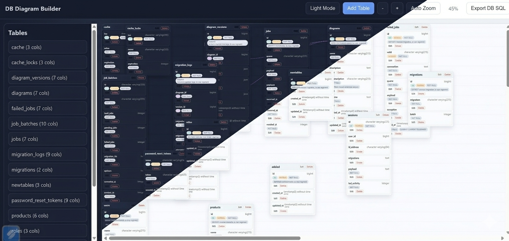
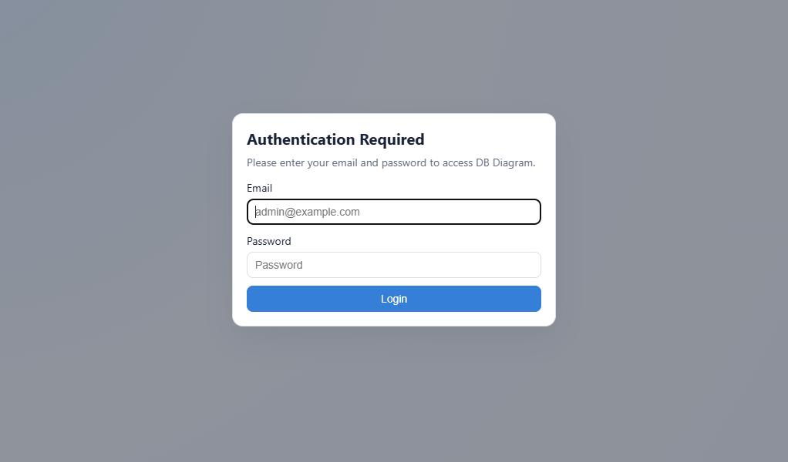

# DB Digram

Interactive database diagram builder for Laravel.

This package provides a visual UI to inspect your schema, create/update/delete tables and columns, and export SQL.

## Requirements

- PHP 8.2+
- Laravel 11 or 12

## Installation

### Use this command to install it

```bash
composer require hisee/db-digram
```

## Service Provider

Laravel package auto-discovery is enabled, so no manual provider registration is required.

If your app has auto-discovery disabled, register the provider manually in bootstrap/providers.php:

```php
Hussain\DBDigram\DbDigramServiceProvider::class,
```

## Publish Config

After installation, publish the package config file:

```bash
php artisan vendor:publish --tag=db-digram-config
```

This creates `config/db-digram.php` in your app where you can enable/disable the package:

```php
return [
	'enabled' => true,
	'auth' => [
		'enabled' => false,
		'email' => '',
		'password' => '',
		'realm' => 'DB Diagram Access',
	],
];
```

You can also configure these values in `.env`:

```env
DB_DIGRAM_AUTH_ENABLED=true
DB_DIGRAM_AUTH_EMAIL=admin@example.com
DB_DIGRAM_AUTH_PASSWORD=secret-password
DB_DIGRAM_AUTH_REALM="DB Diagram Login"
```

When auth is enabled, the page shows a login modal before the diagram is displayed.



## Usage

Start your app and open:

- /diagram

Main capabilities in the UI:

- View current database schema
- Add table
- Edit table name and table columns
- Delete table
- Add/edit/delete columns
- Define foreign key relationships
- Zoom controls and auto zoom
- Export schema SQL
- Toggle dark and light mode


## Important Notes

- Schema actions create migration files in your host app under database/migrations.
- Table and column changes are applied by running migrations internally.
- Use carefully in production environments.
- Keep backups before destructive schema changes.

